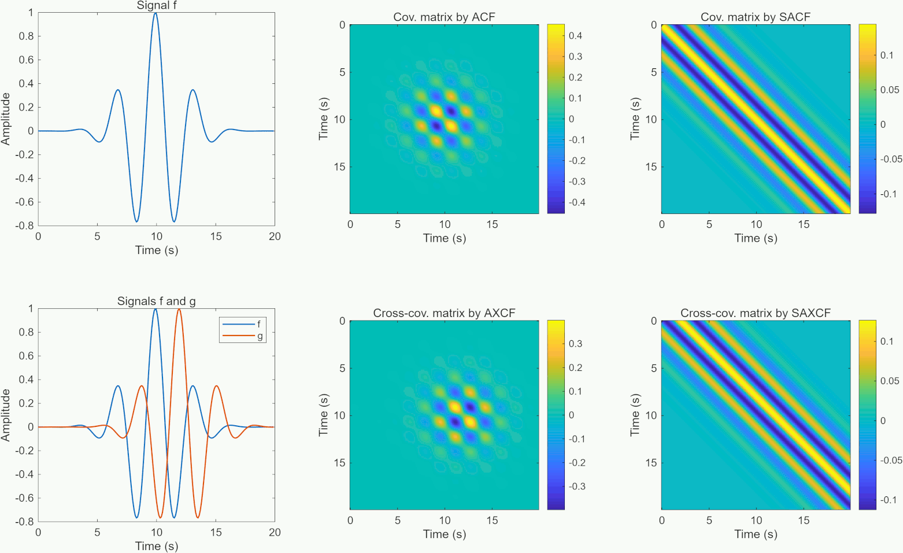

# Uncertainty quantification in Bayesian earthquake source inversions (HPC ready)
Routines for evaluating approximate covariance matrices of Green's functions, designed for uncertainty quantification in Bayesian inversions of earthquake sources (ready for high-performance computing).
***************************************

This repository provides a Fortran90 and MATLAB routines for evaluation of the 
covariance (and cross-covariance) matrices of Green's functions. It is 
specifically designed as a high-performance toolset to efficiently handle 
model uncertainties in Bayesian waveform-based earthquake source inversions. 
It features a dual-language implementation to balance computational power 
(Fortran90) with ease of testing and visualization (MATLAB). List of four 
types of methods implemented in this package:
*   Approximate Covariance Function (ACF)
*   Approximate Cross-covariance Function (AXCF)
*   Stationarized Approximate Covariance Function (SACF)
*   Stationarized Approximate Cross-covariance Function (SAXCF)

1 METHODOLOGY
===================

  Hallo, M., Gallovič, F. (2016). Fast and cheap approximation of Green
functions uncertainty for waveform-based earthquake source inversions,
Geophys. J. Int., 207, 1012-1029. [https://doi.org/10.1093/gji/ggw320](https://doi.org/10.1093/gji/ggw320)

2 TECHNICAL IMPLEMENTATION
===================

[](https://www.python.org/dev/peps/pep-0008/)

Fortran90, High Performance Computing (HPC), Fourier Transform, Cross-Platform (Windows, Linux, macOS)

*   **High Performance:** Core routines implemented in Fortran90 for efficient evaluation of large covariance and cross-covariance matrices.
*   **Dual-Language Implementation:** Fortran90 functions are supplemented with respective MATLAB functions, using identical mathematical logic for seamless testing and prototyping.
*   **Efficient Uncertainty Quantification:** Specifically optimized for handling model uncertainties in Bayesian source inversion frameworks.
*   **Full Matrix Output:** The toolset returns complete covariance structures ready for integration into inverse solvers.

The official software version is archived on Zenodo:

[](https://doi.org/10.5281/zenodo.19343279)

3 PACKAGE CONTENT
===================

  1. `src/approxc.f90` - Fortran 90 module containing the calculation subroutines ACF, AXCF, SACF, SAXCF
  2. `src/example.f90` - Fortran 90 main program for calculating covariances from data in `example_data.txt`
  3. `src/nr.for` - Fortran 77 subroutine four1 from Numerical Recipes
  4. `Makefile` - Compilation script for the Fortran part
  5. `run_example_plot.py` - Python script to load and plot matrices generated by the Fortran code
  6. `requirements.txt` - pip requirements file for instalation of Python dependencies
  7. `axcf.m` - MATLAB function for determining covariance matrices (ACF, AXCF)
  8. `saxcf.m` - MATLAB function for determining stationarized covariance matrices (SACF, SAXCF)
  9. `example.m` - MATLAB example using these two functions

4 REQUIREMENTS
===================

  FORTRAN: Codes fulfill Fortran 90 Standard
  
  Python: Version 3.12 or higher
  
  Python Libraries: matplotlib, numpy
  
  Install Python dependencies via pip:

```bash
pip install -r requirements.txt
```

  MATLAB: Version R2025b
  
  MATLAB Toolboxes: Matlab Curve Fitting Toolbox (`smooth.m`), Matlab Signal Processing Toolbox (`filtfilt.m`)

5 COMPILATION
===================

  1. Open a Linux terminal in the project root directory
  2. To compile Fortran code, type:
```bash
make
```
  3. Check `run_example` binary program in the project root directory
  
6 USAGE
===================
  
  Fortran:
  1. Compile Fortran codes by using `Makefile`
  2. Run the program: `run_example` in the project root directory
  3. Run the Python script: `run_example_plot.py` to visualize results from Fortran
  4. Check for high-resolution output figure `example_Fortran.png`
  
  MATLAB:
  1. Open MATLAB
  2. Run the main script: `example.m` to compute and visualize results
  
7 EXAMPLE OUTPUT
===================

This repository provides Fortran 90 and MATLAB routines for evaluating covariance matrices of Green's functions. The included example codes are for illustrative purposes; for full functionality, users should integrate these subroutines into their own projects. These covariance matrices should be implemented within a Bayesian inversion framework to properly account for uncertainty. Below are figures from a test using simple synthetic waveforms, showing the covariance matrices ACF, AXCF, SACF, and SAXCF.

<picture>
  <source media="(prefers-color-scheme: dark)" srcset="img/cov_dark.png">
  <source media="(prefers-color-scheme: light)" srcset="img/cov_light.png">
  
</picture>

8 COPYRIGHT
===================

Copyright (C) 2016-2018,2026  Miroslav Hallo and František Gallovič

This program is published under the GNU General Public License (GNU GPL).

This program is free software: you can modify it and/or redistribute it
or any derivative version under the terms of the GNU General Public
License as published by the Free Software Foundation, either version 3
of the License, or (at your option) any later version.

This code is distributed in the hope that it will be useful, but WITHOUT
ANY WARRANTY. We would like to kindly ask you to acknowledge the authors
and don't remove their names from the code.

You should have received copy of the GNU General Public License along
with this program. If not, see <http://www.gnu.org/licenses/>.
